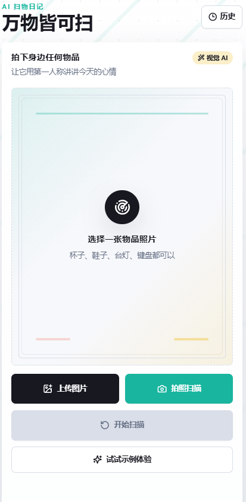
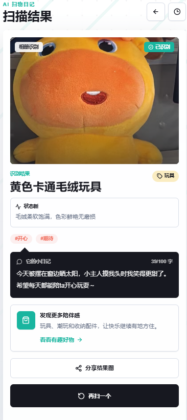
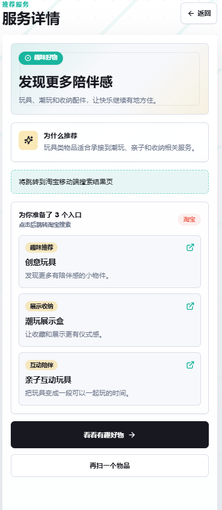

# 万物皆可扫

现实物品的 AR 奇遇记，一个移动端优先的 H5 PoC。用户拍摄或上传一张日常物品照片后，应用调用视觉大模型识别主要物品，并以物品第一人称生成一篇 100 字以内的趣味日记，同时给出一个相关服务推荐和淘宝移动端搜索入口。

项目核心目标不是做一个普通“识物工具”，而是把“扫一扫”扩展成探索现实世界的趣味入口：杯子、鞋子、台灯、植物、键盘都可以拥有自己的小情绪和下一步服务建议。

## 项目状态

当前版本已经可以本地运行、手机局域网访问和完整演示。

- 支持手机拍照和相册上传
- 支持上传图片前端压缩
- 支持扫描中动效和图片预览
- 接入阿里云百炼视觉大模型
- 支持 Mock 示例体验，方便稳定演示
- 支持结构化结果展示
- 支持独立结果页，刷新不丢当前结果
- 支持本地历史记录和历史详情页
- 支持推荐服务卡片和服务落地页
- 支持按物品状态优化推荐策略
- 支持淘宝移动端搜索跳转
- 支持每个服务页展示 3 个模拟商品/服务卡
- 支持结果图生成和系统分享
- 支持 PWA manifest 和主屏幕安装基础能力
- 支持模型请求超时，避免长时间卡在扫描中
- 支持图片过大、识别失败、网络失败、模型格式异常等错误处理

## 效果图


### 首页扫描



### 扫描结果



### 淘宝推荐



## 技术栈

- Next.js 15 App Router
- React 19
- TypeScript
- Tailwind CSS
- lucide-react
- localStorage / sessionStorage
- Canvas 分享图生成
- PWA Web App Manifest / Service Worker
- 阿里云百炼 DashScope OpenAI 兼容接口

## 核心流程

```txt
用户拍照/上传图片
  -> 前端校验图片类型和大小
  -> 前端压缩图片
  -> 展示扫描中动效
  -> 请求 /api/scan-object
  -> 后端调用视觉大模型
  -> 解析模型返回 JSON
  -> 按物品类别和状态映射平台服务推荐
  -> 保存历史记录到 localStorage
  -> 保存当前结果到 sessionStorage
  -> 跳转 /result 展示结果
```

## 运行环境

建议环境：

- Node.js 18.18 或更高版本
- npm 9 或更高版本
- Windows / macOS / Linux 均可
- 手机和电脑需要处于同一局域网，才能用手机访问本地开发服务

检查 Node 和 npm：

```bash
node -v
npm -v
```

## 安装依赖

进入项目根目录：

```bash
cd E:\Project\Mayi
```

安装依赖：

```bash
npm install
```

## 环境变量配置

在项目根目录创建 `.env.local` 文件：

```env
DASHSCOPE_API_KEY=你的百炼 API Key
DASHSCOPE_BASE_URL=https://dashscope.aliyuncs.com/compatible-mode/v1
DASHSCOPE_MODEL=qwen3-vl-32b-thinking
DASHSCOPE_TIMEOUT_MS=30000
SCAN_USE_MOCK=false
```

字段说明：

| 字段 | 作用 |
| --- | --- |
| `DASHSCOPE_API_KEY` | 阿里云百炼 API Key |
| `DASHSCOPE_BASE_URL` | DashScope OpenAI 兼容接口地址 |
| `DASHSCOPE_MODEL` | 使用的视觉大模型 |
| `DASHSCOPE_TIMEOUT_MS` | 模型请求超时时间，默认 `30000` 毫秒 |
| `SCAN_USE_MOCK` | 是否强制使用本地 Mock 数据 |

如果暂时不想调用真实模型，可以设置：

```env
SCAN_USE_MOCK=true
```

修改 `.env.local` 后，需要重启开发服务。

## 本地启动

电脑本机访问：

```bash
npm run dev
```

浏览器打开：

```txt
http://localhost:3000
```

## 手机访问

如果要用手机拍照测试，需要让 Next.js 监听局域网地址：

```bash
npm run dev -- --hostname 0.0.0.0 --port 3000
```

查看电脑局域网 IP：

Windows：

```bash
ipconfig
```

macOS / Linux：

```bash
ifconfig
```

找到类似 `172.23.159.136`、`192.168.x.x` 的 IPv4 地址后，在手机浏览器访问：

```txt
http://你的电脑局域网IP:3000
```

示例：

```txt
http://172.23.159.136:3000
```

注意事项：

- 手机和电脑必须连接同一个 Wi-Fi 或同一局域网
- Windows 防火墙如果拦截 Node.js，需要允许访问
- 如果端口被占用，可以换端口，例如 `--port 3001`

## 常用命令

| 命令 | 作用 |
| --- | --- |
| `npm install` | 安装项目依赖 |
| `npm run dev` | 启动本地开发服务 |
| `npm run dev -- --hostname 0.0.0.0 --port 3000` | 启动局域网可访问的开发服务 |
| `npm run type-check` | TypeScript 类型检查 |
| `npm run build` | 生产构建 |
| `npm run start` | 启动生产服务，需要先执行 `npm run build` |

## 功能说明

### 首页扫描

首页提供三个入口：

- 上传图片：从相册选择物品照片
- 拍照扫描：调用手机摄像头拍摄物品
- 示例体验：使用本地 Mock 图片和 Mock 结果快速体验完整流程

选择图片后，前端会先做文件类型、大小校验，再压缩图片，降低模型请求体积。

### 扫描中状态

扫描中页面会展示：

- 原图预览
- 扫描线动画
- 扫描状态提示

这里故意保留短暂等待时间，让 AI 识别过程更像一个完整产品体验，而不是按钮点完后突然切页。

### 结果页

扫描成功后进入 `/result`，展示：

- 物品图片
- 识别来源
- 物品名称
- 物品类别
- 物品状态
- 100 字以内第一人称日记
- 情绪标签
- 推荐服务卡片
- 分享结果图按钮
- 再扫一个按钮

当前结果会保存到 `sessionStorage`，所以刷新 `/result` 不会丢失最近一次扫描结果。

### 服务推荐

AI 只负责识别物品和生成日记，服务推荐由本地服务映射层统一生成，避免模型直接编造不可控链接。

推荐策略会同时参考物品类别和状态：

| 状态 | 推荐优先级 |
| --- | --- |
| `dirty` | 优先推荐清洁护理 |
| `damaged` | 优先推荐维修、替换件或安全换新 |
| `worn` | 优先推荐养护、修补和易耗件替换 |
| `idle` | 优先推荐回收、转卖、收纳或旧物改造 |
| `new` / `used` / `unknown` | 回到物品类别推荐 |

推荐服务卡点击后进入：

```txt
/service/[serviceId]
```

服务页包含：

- 服务标题
- 推荐理由
- 3 个模拟商品/服务卡
- 淘宝移动端搜索入口

当前淘宝跳转使用搜索链接：

```txt
https://main.m.taobao.com/search/index.html?q=关键词
```

这不是淘宝客转链，也没有真实价格、库存、优惠券和佣金追踪。

### 历史记录

扫描成功后会保存到 `localStorage`，历史页路径：

```txt
/history
```

历史功能包括：

- 展示最近扫描记录
- 查看历史详情
- 清空历史记录
- 历史详情页再次查看服务推荐和分享图

历史详情页路径：

```txt
/history/[recordId]
```

### 分享结果图

结果页和历史详情页支持生成分享图：

- 使用浏览器 Canvas 本地生成 PNG
- 支持系统 Web Share 时直接调起分享
- 不支持 Web Share 时自动下载图片
- 分享图包含物品图片、名称、日记、标签和服务推荐

### PWA 支持

项目已加入 PWA 基础配置：

- `public/manifest.webmanifest`：应用名称、主题色、启动方式和图标
- `public/icons/`：应用图标和 maskable 图标
- `public/sw.js`：轻量 service worker，缓存基础页面和静态资源
- `components/RegisterServiceWorker.tsx`：客户端注册 service worker

部署到 HTTPS 环境后，手机浏览器可通过“添加到主屏幕”获得更接近 App 的入口。本地局域网 HTTP 访问时，部分浏览器会限制 service worker，这是浏览器安全策略。

## API 说明

### `POST /api/scan-object`

请求体：

```json
{
  "imageDataUrl": "data:image/jpeg;base64,...",
  "source": "camera"
}
```

`source` 可选值：

```txt
camera | album | example
```

成功响应：

```json
{
  "ok": true,
  "result": {
    "id": "scan_xxx",
    "objectName": "缺口杯子",
    "category": "drinkware",
    "condition": "damaged",
    "conditionText": "杯口有轻微缺口，仍可作为收纳杯使用。",
    "diary": "今天我又站在桌角发呆，缺口有点疼，但还能替主人收住几支笔。",
    "emotionTags": ["怀旧", "治愈"],
    "service": {},
    "createdAt": "2026-05-07T00:00:00.000Z"
  }
}
```

失败响应：

```json
{
  "ok": false,
  "error": {
    "code": "AI_FAILED",
    "message": "识别失败，请稍后重试"
  }
}
```

## 项目结构

```txt
app/
  layout.tsx
  globals.css
  page.tsx
  result/
    page.tsx
  history/
    page.tsx
    [recordId]/
      page.tsx
  service/
    [serviceId]/
      page.tsx
  api/
    scan-object/
      route.ts
components/
  UploadCard.tsx
  ScanAnimation.tsx
  ScanResultPanel.tsx
  LatestResult.tsx
  ResultBubble.tsx
  ServiceCard.tsx
  ShareResultButton.tsx
  RegisterServiceWorker.tsx
  HistoryList.tsx
  HistoryDetail.tsx
lib/
  api.ts
  dashscope.ts
  imageTools.ts
  mockData.ts
  prompt.ts
  serviceMap.ts
  shareImage.ts
  storage.ts
  types.ts
```

## 文件职责

| 文件 | 功能 |
| --- | --- |
| `app/page.tsx` | 首页页面，承载上传/拍照入口 |
| `app/result/page.tsx` | 独立结果页 |
| `app/history/page.tsx` | 历史记录列表页 |
| `app/history/[recordId]/page.tsx` | 历史记录详情页 |
| `app/service/[serviceId]/page.tsx` | 服务推荐落地页 |
| `app/api/scan-object/route.ts` | 扫描识别后端 API |
| `components/UploadCard.tsx` | 图片选择、压缩、扫描流程控制 |
| `components/ScanAnimation.tsx` | 扫描中动效 |
| `components/ScanResultPanel.tsx` | 结果展示主组件 |
| `components/LatestResult.tsx` | 从 sessionStorage 恢复当前结果 |
| `components/ServiceCard.tsx` | 推荐服务卡片 |
| `components/HistoryList.tsx` | 历史记录列表 |
| `components/HistoryDetail.tsx` | 历史详情展示 |
| `components/ShareResultButton.tsx` | 分享结果图按钮 |
| `components/RegisterServiceWorker.tsx` | PWA service worker 注册 |
| `lib/api.ts` | 前端请求扫描 API 的封装 |
| `lib/dashscope.ts` | 阿里云百炼模型调用 |
| `lib/imageTools.ts` | 前端图片压缩工具 |
| `lib/mockData.ts` | 示例图片和 Mock 结果 |
| `lib/prompt.ts` | 视觉模型提示词 |
| `lib/serviceMap.ts` | 物品类别到服务推荐的映射 |
| `lib/shareImage.ts` | Canvas 结果图生成 |
| `lib/storage.ts` | localStorage / sessionStorage 封装 |
| `lib/types.ts` | 核心 TypeScript 类型 |

## 数据结构

核心结果类型是 `ScanResult`：

```ts
interface ScanResult {
  id: string;
  objectName: string;
  category: ObjectCategory;
  condition: ObjectCondition;
  conditionText: string;
  diary: string;
  emotionTags: EmotionTag[];
  service: ServiceRecommendation;
  createdAt: string;
}
```

历史记录在 `ScanResult` 基础上增加图片和来源：

```ts
interface HistoryRecord extends ScanResult {
  imageDataUrl: string;
  source: UploadSource;
}
```

## 推荐测试物品

- 杯子：容易触发杯具购买或替换推荐
- 鞋子：容易触发清洁、护理、鞋履服务推荐
- 台灯：容易触发灯具、照明服务推荐
- 植物：容易触发植物养护服务推荐
- 键盘/耳机：容易触发数码配件或维修推荐
- 包、书、衣物、玩具：可测试不同类别映射
- 带污渍、破损、明显磨损或闲置特征的物品：可测试状态优先推荐

## 测试建议

开发时建议依次验证：

1. `npm run type-check`
2. `npm run build`
3. 首页是否能上传图片
4. 手机是否能调用摄像头
5. 扫描成功后是否跳转 `/result`
6. 刷新 `/result` 后当前结果是否仍在
7. 推荐服务卡是否能进入服务页
8. 淘宝入口是否能打开移动端搜索
9. 历史记录是否新增
10. 历史详情是否能打开
11. 清空历史是否生效
12. 分享结果图是否能生成
13. 断网或模型失败时是否能看到错误提示和重试入口

## 已知限制

- 当前是 H5 PoC，不包含用户登录和云端数据库
- 历史记录仅保存在当前浏览器本地
- `sessionStorage` 只保存当前标签页最近一次结果，关闭标签页后会清空
- 淘宝入口是搜索跳转，不是淘宝客转链
- 服务商品卡是模拟数据，不是真实商品价格或库存
- 当前只识别单张图片中的主要物品，不做多物体检测
- 不包含实时 WebAR 和视频流识别

## 后续优化方向

- 接入淘宝开放平台或阿里妈妈淘宝客
- 引入真实商品数据、价格、库存、优惠券
- 增加云端用户系统和跨设备历史记录
- 增加多物品识别和用户手动选择主体
- 增加更多分享海报模板和二维码
- 增加物品人格设定、多轮追问和收藏功能
- 完善 PWA 离线页、安装引导和应用图标尺寸
